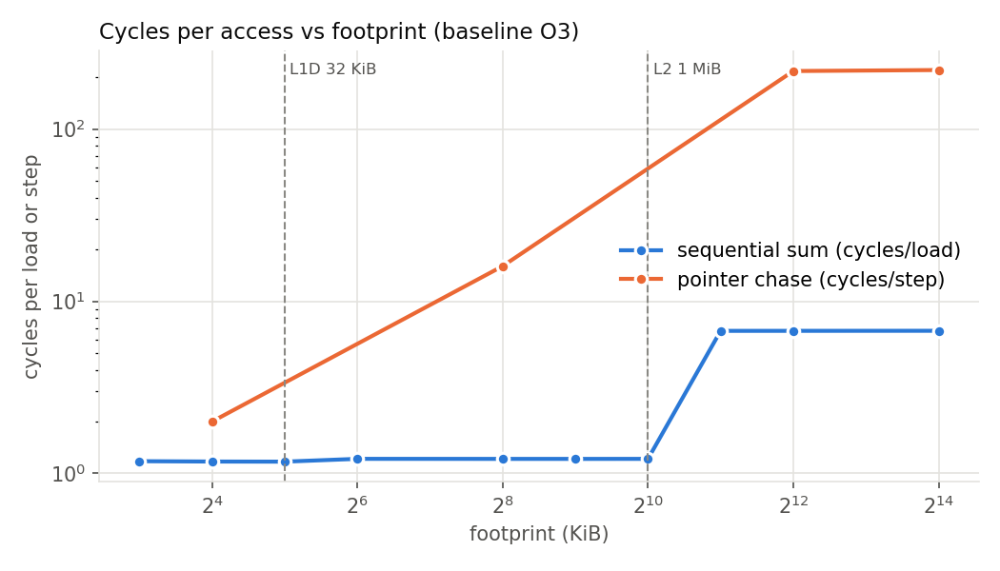
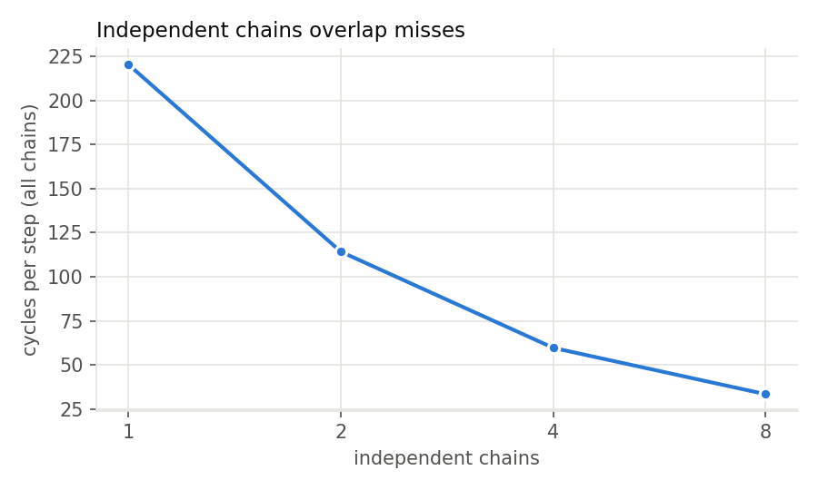

# Stage 2: microbenchmark suite and simulator validation

gem5 reproduced textbook behaviour for capacity steps, dependent-load latency, independent-miss overlap, and branch predictability. It departed from simple theory in three places: the compute loop is serialized by gem5's x86 multiply micro-ops, conflict sets under the O3 core miss far less often than cyclic-LRU theory predicts, and strided DRAM access gets faster at the largest strides. All 40 runs passed validation (experiment `s2-micro`, `results/stage2_micro.csv`; every table here is printed by `analysis/stage2.py`).

## Common to all studies

Each microbenchmark in `workloads/micro/` marks its region of interest with `m5_reset_stats` / `m5_dump_stats`, checks its own result, and prints PASS or FAIL. Hypotheses were committed (`a65c0a5`) before any run.

- Controlled variables: baseline hardware (`docs/architecture.md`: O3, 3 GHz, 32 KiB/8-way L1D, 1 MiB/16-way L2, 64 B lines, no prefetcher, DDR4-2400), one binary per benchmark, fixed work per benchmark (loads, steps, or iterations), fixed input seeds.
- Metrics: IPC, cycles per unit of work, L1D line misses per unit, L2 miss rate, DRAM bytes per unit, average outstanding misses (MLP), branch mispredictions.
- Validation: every run printed PASS, `config.ini` matched the requested configuration, the ROI dump was used (two dumps per run), and the tree was clean at run start. Two runs (chase 16 KiB and 256 KiB) first started while a commit was being made, were flagged by `collect.py`, and were rerun (array 24154474).

gem5's `demandMisses` counts every access that misses in the tag array, including accesses to a line whose miss is already in flight. "Line misses" below are `demandMshrMisses`, one per line fetched. MLP is the average number of outstanding demand misses (`docs/stats.md`).

## Study: sequential sum across the hierarchy

Question: does sustained load throughput step down where the array stops fitting in L1D (32 KiB) and in L2 (1 MiB)?
Suspected mechanism: capacity misses; sequential access lets the O3 core overlap misses.
Hypothesis and prediction: flat, highest IPC up to 32 KiB; a drop from 64 KiB to 1 MiB (one line miss per 8 loads, L2 hits); a second, larger drop from 2 MiB (DRAM, one line per 8 loads), smaller than the DRAM/L2 latency ratio because misses overlap.
Independent variable: array size, 8 KiB to 16 MiB (2M loads each).

Results

| Footprint | IPC | Cycles/load | L1D line misses/load | L2 miss rate | DRAM B/load | L2 MLP |
|---|---|---|---|---|---|---|
| 8, 16, 32 KiB | 3.40 to 3.42 | 1.17 to 1.18 | 0.000 to 0.002 | n/a | 0 | 0 |
| 64 KiB to 1 MiB (4 sizes) | 3.29 | 1.21 to 1.22 | 0.125 | 0.000 | 0 | 0 |
| 2, 4, 16 MiB | 0.594 | 6.73 | 0.125 | 1.000 | 8.00 | 2.83 |

Observations
- L1D-resident and L2-resident sizes differ by 4 percent in cycles per load; every L1D line miss hit in L2 up to and including 1 MiB.
- Beyond L2, cycles per load rose 5.5x. DRAM supplied one 64-byte line per 8 loads: 53.8 cycles per line, 3.6 GB/s at 3 GHz, 19 percent of the channel's 19.2 GB/s peak.
- About 2.8 L2 misses were outstanding on average; rename found the ROB full about 0.8M times in 2M loads; mean DRAM access latency was 23 ns.

Interpretation: TODO(Nirak)

Competing explanations for the DRAM plateau: ROB capacity (192 entries at about 4 instructions per load covers about 6 lines); MSHRs (16 at L1D, 20 at L2) do not bind at 2.8 outstanding; DRAM queueing is low.
Follow-up: Stage 4 MLP and prefetch studies.

## Study: strided access

Question: how do cycles per load change as the stride grows from 1 to 64 elements (8 to 512 B)?
Suspected mechanism: one line fetched per 8/stride loads until stride 8, then one per load.
Hypothesis and prediction: line misses per load 1/8, 1/4, 1/2, then 1; cycles rise with misses up to stride 8 and then flatten, possibly rising again at 256 and 512 B strides.
Independent variable: stride (8 MiB array, 1M loads).

Results

| Stride (elements) | Cycles/load | Line misses/load | DRAM B/load | L2 MLP | DRAM mean access latency (ns) |
|---|---|---|---|---|---|
| 1 | 10.50 | 0.125 | 8 | 1.82 | 23.4 |
| 2 | 10.74 | 0.250 | 16 | 3.69 | 25.2 |
| 4 | 12.12 | 0.500 | 32 | 7.45 | 32.6 |
| 8 | 21.36 | 1.000 | 64 | 14.50 | 75.7 |
| 16 | 20.48 | 1.000 | 64 | 14.47 | 71.3 |
| 32 | 18.87 | 1.000 | 64 | 14.42 | 63.3 |
| 64 | 15.65 | 1.000 | 64 | 14.30 | 47.2 |

Observations
- Line misses per load matched the prediction exactly.
- Up to stride 4, 4x the misses cost 15 percent more cycles, because outstanding misses grew with them (L2 MLP 1.8 to 7.4).
- From stride 8, MLP stayed near 14.4 and cycles per load followed DRAM mean access latency, which fell from 75.7 ns at stride 8 to 47.2 ns at stride 64.
- Stride 1 (10.5 cycles/load) was slower than the sequential sum over the same bytes (6.7); the strided loop retires more instructions per load (7.0 vs 4.2).

Interpretation: TODO(Nirak)

Competing explanations for faster large strides: the DDR4 address mapping spreads larger strides over more banks, so fewer requests queue behind one bank; or row-buffer hits at stride 8 serve long same-row bursts in order while other requests wait. Per-bank DRAM statistics would separate them.
Follow-up: open question in `docs/progress.md`.

## Study: dependent pointer chase

Question: does one chain of dependent loads expose each level's full latency?
Suspected mechanism: each load's address comes from the previous load, so no two misses overlap.
Hypothesis and prediction: a few cycles per step in L1D, about 12 to 25 in L2, well over 100 in DRAM.
Independent variable: footprint (1M steps, one node per line).

Results

| Footprint | Cycles/step | L2 miss rate | L2 MLP |
|---|---|---|---|
| 16 KiB | 2.00 | n/a | 0 |
| 256 KiB | 16.00 | 0.000 | 0 |
| 4 MiB | 217.3 | 1.000 | 0.98 |
| 16 MiB | 220.3 | 1.000 | 0.98 |

Observations: load-to-use latency was 2 cycles (L1D), 16 cycles (L2), and about 220 cycles or 73 ns (DRAM), with at most one miss outstanding, as predicted.

Interpretation: TODO(Nirak)

Competing explanations: none needed for the ordering; the absolute DRAM figure includes L1D, L2, crossbar, and controller latency on top of the device.
Follow-up: Stage 4 CPU-model study.

## Study: independent chains (memory-level parallelism)

Question: do independent miss chains overlap in the O3 core?
Suspected mechanism: the ROB holds the next step of every chain, so their misses are in flight together.
Hypothesis and prediction: near-proportional speedup at 2 and 4 chains, less than proportional at 8.
Independent variable: chains (16 MiB footprint, 1M total steps).

Results

| Chains | Cycles/step | Speedup vs 1 chain | L2 MLP | LQ full events | DRAM mean access latency (ns) |
|---|---|---|---|---|---|
| 1 | 220.3 | 1.00 | 0.98 | 0 | 44.5 |
| 2 | 114.2 | 1.93 | 1.96 | 0 | 47.2 |
| 4 | 59.7 | 3.69 | 3.93 | 0 | 50.6 |
| 8 | 33.4 | 6.59 | 7.85 | 166,736 | 60.0 |

Observations: outstanding misses equalled the chain count; the shortfall from linear speedup at 8 chains coincided with a 35 percent rise in DRAM access latency and the first load-queue-full stalls.

Interpretation: TODO(Nirak)

Competing explanations for the 8-chain shortfall: DRAM queueing (latency rose) versus load-queue capacity (32 entries; stalls appeared). The Stage 4 MLP study varies LQ size to separate them.
Follow-up: Stage 4 MLP study.

## Study: compute-bound loop

Question: what IPC does the core reach with no memory traffic?
Suspected mechanism: four independent multiply-add chains limited by multiplier latency and issue width.
Hypothesis and prediction: IPC 3 to 4, about 3 cycles per iteration.
Independent variable: none (single run, 2M iterations).

Results: 12.00 cycles per iteration, IPC 0.917, no L1D misses; 11 instructions and 22 micro-ops per iteration; `statFuBusy::IntMult` = 0.

Observations: the four multiplies are independent in the source and in the binary (`imul %rdx` into `%r15`, `%rbx`, `%r13`, `%r12`), yet each iteration took 4 x 3 cycles, the multiplier latency times the number of multiplies, and no multiply ever waited for a functional unit. gem5's x86 microcode for `IMUL r64, r64` is `mul1s reg, regm` then `mulel reg` and `muleh t0`: the multiply writes an implicit product register that the next two micro-ops read.

Interpretation: TODO(Nirak)

Competing explanations: a dependence through the implicit product register serializes every multiply in flight (consistent with zero FU contention and exactly 3 cycles per multiply); alternatively a scheduling restriction on these micro-ops. Either way it is a property of gem5's x86 model, not of the workload, and it caps IPC for multiply-heavy integer code in this study.
Follow-up: Stage 4 CPU-model study runs the same loop on Minor and TimingSimple.

## Study: branch patterns

Question: does the default TournamentBP predictor behave as expected on regular and irregular outcome sequences?
Suspected mechanism: history-based prediction learns constant and alternating patterns and long runs; random outcomes defeat it.
Hypothesis and prediction: near 0 mispredictions for taken, alternating, and sorted; about 50 percent of the data-dependent branch for random, with a large IPC drop.
Independent variable: outcome pattern (same loop, 1M iterations; random and sorted use the same bytes).

Results

| Pattern | IPC | Mispredicted conditional branches | Per data-dependent branch | Squashed instructions |
|---|---|---|---|---|
| always taken | 3.416 | 2 | 0.000 | 165 |
| alternating | 3.429 | 8 | 0.000 | 417 |
| random | 0.879 | 524,622 | 0.500 | 24.1M |
| sorted | 3.451 | 5 | 0.000 | 313 |

Observations: as predicted. gem5's `condPredicted` also counts wrong-path branches (7.8M predicted on the random pattern against 2.1M on the others, for the same 1M iterations), so its misprediction rate reads 6.7 percent while the committed data-dependent branch mispredicted half the time. Random outcomes cost 3.9x in cycles; sorting the same bytes removed the cost.

Interpretation: TODO(Nirak)

Competing explanations: none; the four patterns share instructions and memory behaviour.
Follow-up: Stage 4 CPU-model study (random pattern on all three models).

## Study: cache conflicts at fixed capacity

Question: does associativity, not capacity, decide hits when lines share a set?
Suspected mechanism: with more lines than ways in one set, LRU under cyclic access evicts each line just before its reuse.
Hypothesis and prediction: at 4 KiB spacing, hits up to 8 lines and a miss on every access from 9; at 64 KiB spacing, L2 misses beyond 16 lines; at 64 B spacing, hits.
Independent variable: lines and spacing (1M loads each).

Results

| Spacing | Lines | L1D line misses/load | L2 miss rate | DRAM B/load | Cycles/load |
|---|---|---|---|---|---|
| 4 KiB | 4 / 8 | 0.000 / 0.000 | n/a | 0 | 2.00 / 2.00 |
| 4 KiB | 9 | 0.062 | 0.000 | 0 | 2.04 |
| 4 KiB | 12 | 0.250 | 0.000 | 0 | 2.06 |
| 4 KiB | 16 | 0.662 | 0.000 | 0 | 2.68 |
| 64 B | 9 / 16 / 24 | 0.000 | n/a | 0 | 2.00 / 2.63 / 2.42 |
| 64 KiB | 16 | 0.625 | 0.000 | 0 | 2.63 |
| 64 KiB | 17 | 0.673 | 0.000 | 0 | 2.62 |
| 64 KiB | 24 | 0.801 | 0.383 | 19.65 | 3.41 |

Observations
- The associativity boundary exists: 8 lines in one L1D set never missed and 9 did, while the same 9 to 24 lines spread over sets (64 B spacing) never missed.
- Beyond the boundary the miss rate was far below the 1.0 of cyclic access under LRU: 0.06 at 9 lines, 0.25 at 12, 0.66 at 16. At 64 KiB spacing 17 lines in one L2 set gave no L2 misses and 24 lines an L2 miss rate of 0.38.
- Cycles per load barely moved (2.00 to 2.06) up to 12 lines because L2 hits were overlapped.

Interpretation: TODO(Nirak)

Competing explanations: the O3 core issues loads out of program order with several rounds of the loop in flight, so the cache does not see a strict cycle; or recency is updated at access time while a missing line is inserted at fill time, after later accesses. Both predict cyclic-LRU behaviour on an in-order core.
Follow-up: the Stage 4 CPU-model study adds the 9- and 16-line 4 KiB conflict runs on TimingSimple and Minor.

## Where gem5 matched theory and where it did not

| Behaviour | Matched? |
|---|---|
| Capacity steps at the L1D and L2 sizes; line misses per load for sequential and strided access | Yes |
| Load-to-use latency of each level exposed by a dependent chain | Yes |
| Independent chains overlap misses, nearly linearly to 8 | Yes |
| Predictability of taken, alternating, random, and sorted outcomes | Yes |
| Associativity boundary at 8 ways (L1D) | Yes |
| Miss rate beyond the associativity boundary under cyclic access | No: far below 1.0 on O3 (open question) |
| Four independent 64-bit multiplies per iteration overlap | No: serialized, 3 cycles each (gem5 x86 multiply micro-ops) |
| Strided DRAM cost rises or flattens with stride | No: falls from stride 8 to 64, following DRAM access latency (open question) |
