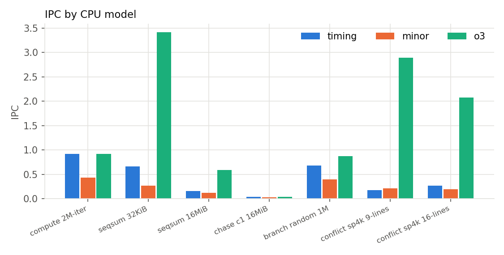
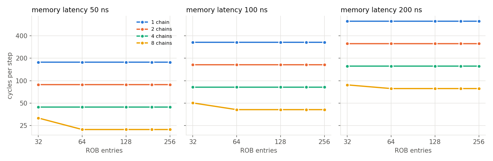

# Stage 4: mechanism studies

Each study isolates one mechanism with the Stage 2 microbenchmarks. The main findings: a larger ROB helps only when independent misses exist and only until it holds one step of every chain; cache capacity and associativity behave as step functions at the expected sizes, softened for associativity by out-of-order issue; longer lines help sequential access and cost bandwidth on sparse access; and in gem5 v25.1, MinorCPU runs slower than TimingSimpleCPU because its branch predictor is never consulted. Hypotheses were committed (`524dfe6`, `669a57f` for the CPU-model follow-up) before the corresponding runs. Tables are printed by `analysis/stage4.py`.

Common validation for every run: PASS printed, `config.ini` matches the request, ROI dump used, clean tree, and ROI instructions identical across hardware configurations for each binary and argument set (this holds across the three CPU models too).

## Study: CPU model

Question: which mechanisms explain the IPC gap between TimingSimpleCPU, MinorCPU, and O3CPU on compute, streaming, and pointer-chase code?
Suspected mechanism: TimingSimple executes one instruction at a time and waits for every memory access; Minor is an in-order pipeline; O3 issues out of order up to 8 wide and overlaps independent misses.
Hypothesis and prediction: compute: TimingSimple at or below 1, Minor 1 to 2, O3 highest. L1-resident streaming: O3 well above Minor. DRAM streaming: O3's advantage grows. Pointer chase: all three about equal. Random branches: O3 loses most relative to its compute IPC. Follow-up from Stage 2: conflict sets miss on every access on the in-order models.
Independent variable: `--cpu` {timing, minor, o3}. Controlled: binaries, inputs, caches, memory (experiment `s4-cpu`, 21 runs).
Metrics: IPC, cycles per unit of work, L1D line misses, L2 MLP.
Validation: standard; ROI instructions matched across the three models for all seven workloads.

Results

| Workload | TimingSimple IPC | Minor IPC | O3 IPC | O3 / TimingSimple |
|---|---|---|---|---|
| compute (4 multiply chains) | 0.917 | 0.431 | 0.917 | 1.00 |
| seqsum 32 KiB (L1D) | 0.667 | 0.267 | 3.419 | 5.13 |
| seqsum 16 MiB (DRAM) | 0.163 | 0.119 | 0.594 | 3.64 |
| pointer chase 16 MiB | 0.035 | 0.034 | 0.036 | 1.05 |
| branch, random | 0.686 | 0.399 | 0.879 | 1.28 |
| conflict, 9 lines, 4 KiB spacing | 0.181 | 0.210 | 2.891 | 16.0 |
| conflict, 16 lines, 4 KiB spacing | 0.267 | 0.200 | 2.077 | 7.78 |

| Workload | L1D line misses per load: TimingSimple / Minor / O3 | L2 MLP: TimingSimple / Minor / O3 |
|---|---|---|
| seqsum 16 MiB | 0.125 / 0.125 / 0.125 | 0.75 / 0.55 / 2.83 |
| conflict 9 lines | 1.000 / 1.000 / 0.062 | 0 / 0 / 0 |
| conflict 16 lines | 1.000 / 1.000 / 0.653 | 0 / 0 / 0 |

Observations
- Pointer chase: all three models took 220 to 232 cycles per step, as predicted.
- DRAM streaming: O3 kept 2.8 L2 misses outstanding on average against 0.75 (TimingSimple) and 0.55 (Minor); its IPC was 3.6x TimingSimple's.
- Compute: TimingSimple and O3 tied at 12 cycles per iteration, the serialized-multiply time found in Stage 2, so O3 gains nothing on this loop.
- Conflict follow-up: on both in-order models the 9- and 16-line sets missed in L1D on every access (1.000), as cyclic LRU predicts; only O3 showed the low miss rates of Stage 2.
- MinorCPU was slower than TimingSimpleCPU on every workload except the conflict set at 9 lines (0.210 vs 0.181), contrary to the prediction. In the ROI of seqsum 32 KiB, Minor's branch predictor recorded zero lookups, Minor fetched 33.6M instructions to commit 8.4M, and discarded 8.4M micro-ops, about one per committed instruction.

Interpretation: TODO(Nirak)

Competing explanations: for Minor, (a) its fetch stage does not consult the branch predictor for these x86 branches, so every taken branch redirects fetch and discards the wrong-path work (consistent with zero lookups and one discard per instruction); (b) Minor's default x86 configuration (`fetch1FetchLimit=1`, issue width 2, memory issue limit 1) limits throughput on its own. For the conflict sets, the in-order result supports out-of-order issue on O3, rather than gem5's LRU implementation, as the cause of the Stage 2 deviation.
Follow-up: none planned; the rest of ArchForge uses O3 only.

## Study: memory-level parallelism

Question: does a larger ROB help only when independent misses exist?
Suspected mechanism: with one chain, each load's address depends on the previous load, so one miss is outstanding whatever the window; with k chains up to k misses overlap if the ROB holds the next step of every chain.
Hypothesis and prediction: 1 chain flat across ROB sizes; more chains faster in proportion while the ROB holds one step of every chain; the benefit grows with memory latency; the load queue does not bind at 8 or more entries except possibly at 8 chains.
Independent variables (designed factorial): ROB {32, 64, 128, 192, 256} x chains {1, 2, 4, 8} x memory latency {50, 100, 200 ns}; plus LQ {8, 16, 32, 64} x chains at ROB 192, 100 ns.
Controlled: 16 MiB footprint, 512K total steps, SimpleMemory (fixed latency, 19.2e9 B/s), O3 otherwise at baseline (experiment `s4-mlp`, 72 runs).
Metrics: cycles per step, average outstanding L2 misses, ROB-full and LQ-full events.

Results: cycles per step

| Latency | ROB | 1 chain | 2 chains | 4 chains | 8 chains |
|---|---|---|---|---|---|
| 50 ns | 32 | 177.0 | 88.5 | 44.3 | 31.6 |
| 50 ns | 64 to 256 | 177.0 | 88.5 | 44.3 | 22.1 |
| 100 ns | 32 | 327.0 | 163.5 | 81.8 | 50.3 |
| 100 ns | 64 to 256 | 327.0 | 163.5 | 81.8 | 40.9 |
| 200 ns | 32 | 627.0 | 313.5 | 156.8 | 87.8 |
| 200 ns | 64 to 256 | 627.0 | 313.5 | 156.8 | 78.4 |

(Rows 64, 128, 192, and 256 differ by less than 0.02 cycles per step and are merged.)

Average outstanding L2 misses: 0.98 to 0.99 (1 chain), 1.95 to 1.99 (2), 3.91 to 3.97 (4), and at 8 chains 6.48 / 7.05 / 7.45 with ROB 32 (50 / 100 / 200 ns) against 7.82 / 7.90 / 7.95 with ROB 64 or more.

LQ sweep (ROB 192, 100 ns): LQ 8 slowed 8 chains from 40.87 to 41.75 cycles per step (2 percent) with 20M LQ-full events; LQ 16, 32, and 64 gave 40.87. With 1 to 4 chains LQ 8 caused many LQ-full events (up to 170M) and no change in cycles.

Observations
- Cycles per step are 3 x latency (in cycles at 3 GHz) plus 27 for one chain, and divide exactly by the chain count up to 4 chains at every ROB size.
- The ROB mattered only at 8 chains and only between 32 and 64 entries: 1.43x at 50 ns, 1.23x at 100 ns, 1.12x at 200 ns. Above 64 entries it changed nothing.
- With one chain, rename found the ROB full 4 times per step at ROB 32 to 128 without any effect on cycles.

Interpretation: TODO(Nirak)

Competing explanations for the ROB-32 limit at 8 chains: ROB capacity (one step of 8 chains is about 40 to 45 instructions of this loop, more than 32) versus the IQ or physical registers (not varied). ROB-full events per step fall from 1.19 (ROB 32) to 1.03 (ROB 64) to 0 (ROB 128) while cycles stop changing at 64, so the ROB is the binding structure only at 32.
Follow-up: sensitivity at neighbouring points is built into the factorial (every ROB size and latency).

## Study: cache capacity, associativity, and line size

Question: does each parameter change the misses of the workload built to expose it, by the expected mechanism?
Suspected mechanism: capacity and conflict misses under LRU; spatial locality for line size.
Hypothesis and prediction: listed per parameter in the rows below (written before running; see `524dfe6`).
Independent variable: one parameter per block, others at baseline (experiment `s4-cache`, 56 runs).
Metrics: L1D and L2 line misses per access, cycles per access, DRAM bytes per access.

Results: capacity

| Workload | Footprint | 16 KiB L1D | 32 KiB | 64 KiB |
|---|---|---|---|---|
| seqsum, cycles/load (L1D line misses/load) | 24 KiB | 1.22 (0.125) | 1.17 (0) | 1.17 (0) |
| seqsum | 48 KiB | 1.22 (0.125) | 1.22 (0.125) | 1.17 (0) |
| chase, cycles/step | 24 KiB | 16.00 | 2.00 | 2.00 |
| chase | 48 KiB | 16.01 | 16.01 | 2.00 |

| Workload | Footprint | 256 KiB L2 | 512 KiB | 1 MiB | 2 MiB |
|---|---|---|---|---|---|
| seqsum, cycles/load | 768 KiB | 6.72 | 6.72 | 1.21 | 1.21 |
| seqsum | 1.5 MiB | 6.73 | 6.73 | 6.73 | 1.21 |
| chase, cycles/step | 768 KiB | 202.3 | 202.1 | 16.1 | 16.1 |
| chase | 1.5 MiB | 212.6 | 212.5 | 212.6 | 16.1 |

Results: associativity (all lines in one set; L1D line misses per load, then L2 line misses per load)

| Case | 2 ways | 4 ways | 8 ways | 16 ways | 32 ways |
|---|---|---|---|---|---|
| L1D, 6 lines | 0.281 | 0.133 | 0 | 0 | |
| L1D, 12 lines | 0.603 | 0.500 | 0.250 | 0 | |
| L2, 12 lines (L2 misses) | | 0.153 | 0 | 0 | 0 |
| L2, 24 lines (L2 misses) | | 0.504 | 0.500 | 0.326 | 0 |

Results: line size (cycles per access; DRAM bytes per access)

| Workload | 32 B | 64 B | 128 B |
|---|---|---|---|
| seqsum 16 MiB | 7.20; 8 | 6.74; 8 | 6.09; 8 |
| stride 2 (16 B) | 12.15; 16 | 10.74; 16 | 11.84; 16 |
| stride 16 (128 B) | 20.72; 32 | 20.48; 64 | 40.00; 128 |
| pointer chase 16 MiB | 220.2; 32 | 220.3; 64 | 228.2; 124 |

Observations
- Capacity: every prediction held exactly. A footprint larger than the cache misses on every line under cyclic access (sequential sum: 0.125 misses per load, one per line; chase: every step), and a footprint that fits never misses. The cost of an L1D capacity miss was 4 percent for the sequential sum and 8x for the chase (2 to 16 cycles per step); of an L2 capacity miss, 5.5x and 12.5x to 13x.
- Associativity: the boundary is where predicted (hits once ways equal or exceed lines: 8 ways for 6 lines, 16 for 12, 8 for 12 lines at L2, 32 for 24), but below it misses are well under 1.0 per access, the O3 effect seen in Stage 2 and removed on in-order cores in the CPU-model study.
- Line size: the sequential sum got faster with longer lines (7.20, 6.74, 6.09 cycles per load) at constant DRAM bytes. Stride 16 moved twice the bytes with 128 B lines and took twice the cycles (40.00 vs 20.48). The chase moved 32, 64, and 124 bytes per step; its cycles rose 4 percent at 128 B. Stride 2 was fastest at 64 B, contrary to the prediction that 128 B would help it.

Interpretation: TODO(Nirak)

Competing explanations: for stride 2, 128-byte lines halve line misses but each fill carries two DRAM bursts; with 32 B lines the O3 fetch buffer also shrinks to 32 B (`docs/architecture.md`), a second change bundled into the 32 B point. For stride 16, DRAM bandwidth per useful byte halves at 128 B.
Follow-up: E1 (data layout x line size x prefetcher).

## Study: prefetching

Question: what does gem5's StridePrefetcher do for sequential, strided, and pointer-chase access, at L1D and at L2?
Suspected mechanism: a PC-indexed table detects a constant address delta per load instruction and queues prefetches for the next lines of the stream.
Hypothesis and prediction: sequential and strided loads: high accuracy and coverage, far fewer L1D misses, higher IPC; pointer chase: no useful prefetches, possibly extra DRAM traffic; L2 placement helps streams less than L1D placement.
Independent variable: prefetcher {none, stride at L1D, stride at L2}. Controlled: Stage 2 inputs (seqsum 16 MiB, stride 4/8/16 over 8 MiB, chase 16 MiB with 512K steps), baseline hardware (experiment `s4-prefetch`, 15 runs).
Metrics: speedup over no prefetcher, L1D and L2 line misses per access, gem5 prefetcher statistics (issued, useful, accuracy, coverage, late, removed because demand came first), DRAM bytes.

Results

| Workload | Prefetcher | Speedup | L1D line misses/access | L2 line misses/access | Issued | Late | Removed (demand first) | gem5 accuracy / coverage | DRAM bytes vs none |
|---|---|---|---|---|---|---|---|---|---|
| seqsum 16 MiB | L1D | 1.95 | 0.002 | 0.125 | 1.01M | 0.75M | 0 | 0.000 / 0.003 | +0.0% |
| seqsum 16 MiB | L2 | 1.99 | 0.125 | 0.117 | 1.01M | 0.75M | 0 | 0.016 / 0.797 | +0.0% |
| stride 4 (32 B) | L1D | 1.09 | 0.008 | 0.500 | 2.02M | 1.50M | 0 | 0.000 / 0.014 | +0.0% |
| stride 4 | L2 | 1.08 | 0.500 | 0.500 | 2.02M | 1.50M | 1 | 0.000 / 0.018 | +0.0% |
| stride 8 (64 B) | L1D | 1.00 | 0.994 | 1.000 | 12.5K | 6.4K | 1.03M | 0.009 / 0.000 | +0.0% |
| stride 8 | L2 | 1.00 | 1.000 | 0.999 | 3.96M | 2.93M | 16K | 0.000 / 0.042 | +0.0% |
| stride 16 (128 B) | L1D | 1.00 | 0.992 | 1.000 | 17.6K | 9.2K | 1.01M | 0.015 / 0.000 | +0.0% |
| stride 16 | L2 | 1.00 | 1.000 | 0.999 | 3.74M | 2.72M | 33K | 0.000 / 0.025 | +0.0% |
| chase 16 MiB | L1D or L2 | 1.00 | 1.000 | 1.000 | 0 | 0 | 0 | n/a | +0.0% |

Observations
- The sequential sum ran about twice as fast with either placement, at unchanged DRAM bytes. At L1D, demand line misses fell from 0.125 to 0.002 per load; 1.01M prefetches were issued for 262K lines and 0.75M of them were still in flight when the demand access arrived (late).
- gem5's `accuracy` and `coverage` report near zero for the L1D prefetcher on the sequential sum despite the 1.95x speedup, because a prefetch caught in flight is counted as late, not useful.
- For stride 8 and 16 at L1D, the prefetcher generated about 4M candidates but issued almost none: about 1M were dropped because a demand request for the same line was already outstanding. At L2 it issued about 4M, three quarters of them late, and changed nothing.
- Stride 4 gained 8 to 9 percent: L1D misses nearly vanished but L2 misses per load stayed at 0.5.
- The pointer chase generated no prefetch candidates at all (no stable per-PC delta), so it added no DRAM traffic, better than the prediction of useless prefetches.
- No configuration added DRAM traffic: every issued prefetch targeted a line the program read.

Interpretation: TODO(Nirak)

Competing explanations for the sequential-sum speedup at unchanged traffic: prefetches raise the number of lines in flight beyond what the ROB-limited demand stream sustains (Stage 2 measured 2.8 outstanding L2 misses without prefetching), versus shorter per-miss latency from DRAM row-buffer hits when requests arrive in address order. For the strided cases, the O3 core already issues the demand misses as early as the prefetcher could, so the prefetcher has no lead time to exploit.
Follow-up: E1 measures the prefetcher on AoS and SoA layouts across line sizes.
