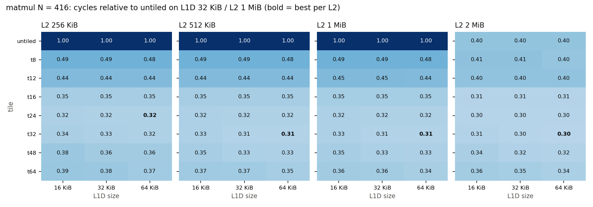
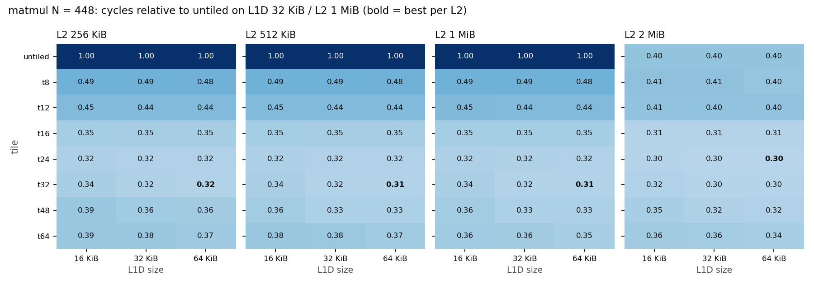

# Stage 6: co-design study, tiling x cache hierarchy

Tiling removed most of matrix multiply's sensitivity to private cache capacity: the untiled kernel ran 2.5x faster only when the L2 grew to 2 MiB and held B, while every tiled kernel varied by at most 1.23x across the whole 12-point hardware grid. Choosing tile and caches jointly beat the best software-only choice by 6 to 7 percent and the best hardware-only choice by 35 percent. The best tile was 24 or 32 in every hardware configuration, shifting from 24 toward 32 as L1D grew from 16 KiB, as predicted, but by a margin of only 0.3 to 5 percent. All 192 runs passed validation, including identical ROI instruction counts across the 12 hardware configurations of each (tile, N) (experiment `s6-codesign`, `results/stage6_codesign.csv`, tables and figures from `analysis/stage6.py`).

The question, hypothesis, and predictions below were committed (`eb1f8b7`, revised in `592ae5c` before any run) ahead of the simulations.

Design change before running (Stage 5 timing): full square products at N = 320 and 384 cannot finish inside the 30-minute per-simulation limit (untiled N = 320 took more than 22 minutes in Stage 5, and 384 is 1.7x the work). Following the rule to shrink the input rather than raise the limit, each run computes a 128-row band of C (R = 128) for N = 416 and N = 448. The band reads all of B and consists of 128/T ii blocks (the last one partial for T = 12, 24, and 48), each with the same access pattern as a block of the full product; touched working sets are 2.13 MiB and 2.41 MiB (B plus the A and C bands), above the largest L2. B alone is 1.32 MiB and 1.53 MiB, so with a 2 MiB L2 the untiled kernel can keep B in L2; the prediction for that column is adjusted accordingly.

## Study: tiling x private cache capacity for matrix multiply

Question: how does loop tiling change matrix multiply's sensitivity to private cache capacity, and does choosing tile size and cache configuration jointly beat choosing either alone?

Suspected mechanism: in the tiled ikj kernel (`workloads/apps/matmul.c`), the inner two loops reuse one T x T block of B (8T^2 bytes) across T rows of A and C, and each row segment of C (8T bytes) across T values of k. Reuse is captured when the block of B plus the active C segments fit in the level that serves them: for T = 32 the B block is 8 KiB, for T = 64 it is 32 KiB. The untiled ikj kernel streams a full row of B (N x 8 bytes) per k and reuses B only across i, so it needs all of B (1.32 MiB at N = 416, 1.53 MiB at N = 448) resident in L2 to avoid DRAM traffic.

Hypothesis and prediction:
1. Untiled is the most capacity-sensitive: its cycles fall sharply once L2 holds B (only the 2 MiB L2 at both sizes) and depend little on L1D.
2. Tiled kernels are insensitive to L2 once the B block fits in L1D or L2, so the cycles spread across the four L2 sizes is much smaller than for untiled.
3. The best tile grows with L1D: the largest tile whose B block fits comfortably in L1D (about half of it, leaving room for A and C) should win: T about 16 to 24 at 16 KiB, 32 at 32 KiB, 32 to 48 at 64 KiB. Very small tiles (8) lose to loop overhead (more instructions per multiply-add).
4. Joint optimum: with small caches, tiling recovers most of what a larger cache would buy; the best joint choice beats the best hardware-only change (largest caches, untiled) and the best software-only change (best tile at baseline 32 KiB / 1 MiB), but by a small margin over software-only, because once the tile fits, extra capacity has little left to remove.

Independent variables (designed factorial): tile {untiled, 8, 12, 16, 24, 32, 48, 64} x L1D {16, 32, 64 KiB} x L2 {256 KiB, 512 KiB, 1 MiB, 2 MiB} x N {416, 448} (128-row band).
Controlled variables: O3 at baseline, 8-way L1D and 16-way L2, 64 B lines, no prefetcher, DDR4-2400, gcc -O2, fixed inputs.
Metrics: ROI cycles (primary; instruction counts differ by tile), IPC, L1D and L2 line misses per multiply-add, DRAM bytes, L2 MLP.
Validation: standard checks; ROI instructions identical across all 12 hardware configurations for each (tile, N).
Cost awareness: qualitative only. Larger caches cost area, energy, and access latency; this model keeps cache latencies fixed, so it overstates the benefit of larger caches.

## Results

Heat maps: cycles relative to the untiled kernel on the baseline hardware (L1D 32 KiB, L2 1 MiB), one panel per L2 size; bold marks the best tile for each L2.

### Best tile per hardware configuration (relative cycles; runner-up and its margin)

| L1D | L2 | N = 416 best | N = 416 runner-up | N = 448 best | N = 448 runner-up | Untiled (both N) |
|---|---|---|---|---|---|---|
| 16 KiB | 256 KiB | t24 0.324 | t32 +4.2% | t24 0.324 | t32 +5.4% | 0.999 |
| 16 KiB | 512 KiB | t24 0.324 | t32 +0.5% | t24 0.324 | t32 +3.7% | 0.999 to 1.000 |
| 16 KiB | 1 MiB | t24 0.325 | t32 +0.4% | t24 0.324 | t32 +3.8% | 1.000 |
| 16 KiB | 2 MiB | t24 0.301 | t16 +2.2% | t24 0.300 | t16 +3.0% | 0.400 to 0.401 |
| 32 KiB | 256 KiB | t24 0.321 | t32 +1.5% | t24 0.320 | t32 +0.5% | 0.999 |
| 32 KiB | 512 KiB | t32 0.314 | t24 +2.1% | t32 0.315 | t24 +1.5% | 0.999 |
| 32 KiB | 1 MiB | t32 0.315 | t24 +2.2% | t32 0.316 | t24 +1.5% | 1.000 |
| 32 KiB | 2 MiB | t32 0.298 | t24 +0.1% | t24 0.296 | t32 +1.0% | 0.400 to 0.401 |
| 64 KiB | 256 KiB | t24 0.321 | t32 +0.3% | t32 0.316 | t24 +1.0% | 0.999 |
| 64 KiB | 512 KiB | t32 0.314 | t24 +2.3% | t32 0.313 | t24 +2.0% | 0.999 |
| 64 KiB | 1 MiB | t32 0.314 | t24 +2.4% | t32 0.313 | t24 +2.1% | 1.000 |
| 64 KiB | 2 MiB | t32 0.297 | t24 +0.3% | t24 0.296 | t32 +0.4% | 0.400 |

### Hardware-only, software-only, and joint choices (speedup over untiled on the baseline hardware)

| Choice | N = 416 | N = 448 |
|---|---|---|
| Best hardware-only (untiled) | 2.49 (64 KiB / 2 MiB) | 2.50 (16 KiB / 2 MiB) |
| Best software-only (baseline hardware) | 3.18 (t32) | 3.17 (t32) |
| Best joint | 3.37 (t32, 64 KiB / 2 MiB) | 3.38 (t24, 64 KiB / 2 MiB) |

For the untiled kernel the three L1D sizes at 2 MiB L2 differ by less than 0.01 percent, so the "best hardware-only" L1D is arbitrary; the gain comes entirely from the 2 MiB L2.

### Capacity sensitivity (max/min cycles over the 12 hardware configurations)

| Tile | untiled | t8 | t12 | t16 | t24 | t32 | t48 | t64 |
|---|---|---|---|---|---|---|---|---|
| N = 416 | 2.49 | 1.23 | 1.10 | 1.14 | 1.09 | 1.14 | 1.21 | 1.15 |
| N = 448 | 2.50 | 1.23 | 1.10 | 1.15 | 1.10 | 1.15 | 1.22 | 1.13 |

### Causal chain (N = 416; per multiply-add)

| Configuration | Instructions | L1D line misses | L2 misses | DRAM bytes | L2 MLP | IPC | Cycles |
|---|---|---|---|---|---|---|---|
| untiled, 32 KiB / 1 MiB (baseline) | 8.02 | 0.1256 | 0.1256 | 8.04 | 1.75 | 0.759 | 233.9M |
| untiled, 64 KiB / 2 MiB | 8.02 | 0.1256 | 0.0016 | 0.10 | 0.07 | 1.891 | 93.9M |
| t32, 32 KiB / 1 MiB | 7.32 | 0.0109 | 0.0045 | 0.29 | 0.21 | 2.203 | 73.6M |
| t32, 64 KiB / 2 MiB (joint best) | 7.32 | 0.0083 | 0.0015 | 0.10 | 0.08 | 2.338 | 69.4M |
| t8, 32 KiB / 1 MiB | 8.46 | 0.0316 | 0.0162 | 1.04 | 0.47 | 1.644 | 114.0M |
| t16, 32 KiB / 1 MiB | 7.67 | 0.0166 | 0.0084 | 0.54 | 0.37 | 2.065 | 82.3M |
| t24, 32 KiB / 1 MiB | 7.46 | 0.0119 | 0.0065 | 0.41 | 0.31 | 2.195 | 75.2M |
| t48, 32 KiB / 1 MiB | 7.22 | 0.0091 | 0.0035 | 0.23 | 0.16 | 2.073 | 77.2M |
| t64, 32 KiB / 1 MiB | 7.17 | 0.0763 | 0.0026 | 0.16 | 0.11 | 1.899 | 83.6M |

N = 448 shows the same pattern (`analysis/stage6.py` output).

## Observations

- Untiled: cycles were identical (within 0.01 percent) across L1D sizes and across L2 256 KiB, 512 KiB, and 1 MiB, and fell 2.5x at 2 MiB. Every B access missed in L2 until B (1.32 or 1.53 MiB) fit: L2 misses per multiply-add fell from 0.126 to 0.0016 and DRAM bytes from 8.0 to 0.1.
- Tiled: L2 misses per multiply-add fell monotonically with tile size (0.016 at t8 to 0.0026 at t64), because B is re-read from L2 or DRAM once per ii block. L1D line misses fell with tile size up to t48 (0.0091) and rose tenfold at t64 (0.076): a 64 x 64 block of B is 32 KiB, the whole L1D.
- Instructions per multiply-add fell with tile size (8.46 at t8 to 7.17 at t64) as loop overhead was amortized; t8 and t12 paid about 15 percent more instructions than t32.
- The optimum is flat: the best tile was t24 or t32 in all 24 configurations, the runner-up was within 5.4 percent everywhere, and within 0.5 percent in 6 of 24. t24 won at 16 KiB L1D in every case; t32 won at 32 and 64 KiB with L2 of 512 KiB or 1 MiB. At 2 MiB L2 the ranking between t24 and t32 flipped between the two sizes of N.
- The 2 MiB L2 helped tiled kernels too, by 5 to 7 percent (e.g. t32 at 32 KiB: 0.315 to 0.298), by removing the remaining L2 misses on B.
- Sensitivity: the conclusions hold at both N and at every neighbouring tile and cache size in the grid (the full grid is the neighbourhood of each optimum).

## Interpretation

TODO(Nirak)

## Competing explanations

- The flat t24/t32 optimum could come from two effects cancelling: t32 has fewer L2 misses and instructions, t24 fewer L1D conflicts in a 16 KiB L1D (a 32 x 32 block of B, 8 KiB, plus A and C lines in an 8-way cache). Per-set conflict statistics are not collected.
- The small gain of joint over software-only depends on the model's fixed cache latencies: a real 2 MiB L2 is slower than a 1 MiB one, which would shrink or reverse the 6 to 7 percent.
- The 128-row band reads B from DRAM at least once per run (1.32 or 1.53 MiB against 128 x N^2 multiply-adds); a full product amortizes that first read over N/128 times more work, so the band overstates compulsory DRAM traffic per multiply-add. The effect is small relative to the untiled kernel's 8 bytes per multiply-add but is included in the tiled kernels' 0.1 bytes per multiply-add at 2 MiB.

## Cost awareness (qualitative)

The best hardware-only choice needs a 2 MiB L2 and the best joint choice adds a 64 KiB L1D. Larger caches cost die area, leakage and access energy, and access latency; this model charges none of these (fixed cycle latencies, no power model), so the hardware columns above are upper bounds. Tiling at t24 or t32 on the baseline caches reaches 94 percent of the best joint result at no hardware cost.

## Follow-up

Stage 7 runs TensorForge-generated kernels through the same hardware grid.
