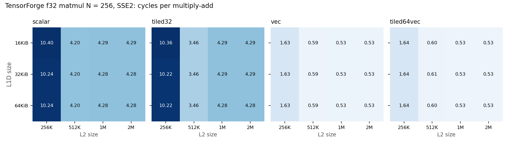

# Stage 7: compiler-generated variants

gcc's `-O3` vectorization with SSE2 halved matrix multiply's instructions and cycles and cut the DRAM-bound reduction's cycles by 53 percent, without changing which lines were touched; `-O1`, `-O2`, and `-O3 -fno-tree-vectorize` were within a few percent of each other. TensorForge's register-tiled, vectorized kernels ran about 8x faster than its scalar kernels on every cache configuration; its cache tiling (M and N only) did not change the scalar kernel's L1D behaviour; and the scalar kernels were slower with a 1 MiB or 2 MiB L2 than with 512 KiB, a non-monotonic result traced to L1D writebacks. Predictions for both studies were committed (`386ef5d`, revised in the commits that changed input sizes) before the runs.

All code stays within gem5's X86 model: no AVX. gcc builds use `-march=x86-64`; TensorForge kernels use `llc -mcpu=x86-64`. `scripts/check_no_avx.sh` and `scripts/build_tf_kernels.sh` verify zero `ymm`/`zmm` uses in every workload object and kernel.

## Study: gcc optimization level

Question: how do `-O1`, `-O2`, `-O3`, and `-O3 -fno-tree-vectorize` change instruction count and memory behaviour for matrix multiply (untiled ikj and tiled 32, a 128-row band of an N = 320 product; the full product took 25 minutes at -O2 in Stage 5, too close to the 30-minute limit for -O1) and the reduction?
Suspected mechanism: at `-O3`, gcc 11 vectorizes the ikj inner loop (`c[j] += a * b[j]`) with SSE2 `mulpd`/`addpd` (2 doubles per instruction) and the reduction with `paddd` (4 integers per instruction); `-O2` in gcc 11 does not vectorize. `-O1` keeps more loads and stores in the loop.
Evidence before running: `objdump` shows `mulpd` in `matmul_O3` and none in `matmul_O2`; `paddd` in the `-O3` reduction kernel and none in `-O3 -fno-tree-vectorize`.
Hypothesis and prediction: `-O3` cuts ROI instructions roughly in half for the vectorized loops (fewer for matmul, whose loop overhead is shared). Cycles fall less than instructions for untiled matmul (memory-bound beyond L2) and for the reduction over 4 MiB (DRAM-bound), and more for tiled 32 (L1-resident inner loops). L1D and L2 line misses and DRAM bytes are nearly unchanged across flags, since vectorization changes how many instructions touch each line, not which lines. `-O3 -fno-tree-vectorize` lands close to `-O2`.
Independent variable: flag set. Controlled: source, inputs, baseline hardware (experiment `s7-flags`, 12 runs, all valid).
Metrics: ROI instructions, cycles, IPC, L1D line misses and DRAM bytes per multiply-add or element.
Validation: standard; each flag set is its own binary, so the cross-configuration instruction check does not apply.

Results (relative to `-O2`; per multiply-add for matmul, per element for reduce)

| Workload | Flags | Instructions (rel) | Cycles (rel) | IPC | Instructions/unit | Cycles/unit | L1D line misses/unit | DRAM B/unit |
|---|---|---|---|---|---|---|---|---|
| matmul ikj | -O1 | 1.000 | 0.986 | 1.921 | 8.03 | 4.18 | 0.126 | 0.112 |
| matmul ikj | -O2 | 1 | 1 | 1.893 | 8.02 | 4.24 | 0.126 | 0.112 |
| matmul ikj | -O3 | 0.505 | 0.523 | 1.830 | 4.05 | 2.22 | 0.126 | 0.112 |
| matmul ikj | -O3 -fno-tree-vectorize | 1.000 | 0.999 | 1.896 | 8.02 | 4.23 | 0.126 | 0.112 |
| matmul tiled 32 | -O1 | 0.996 | 1.116 | 2.011 | 7.29 | 3.63 | 0.0125 | 0.189 |
| matmul tiled 32 | -O2 | 1 | 1 | 2.253 | 7.32 | 3.25 | 0.0125 | 0.189 |
| matmul tiled 32 | -O3 | 0.617 | 0.568 | 2.446 | 4.52 | 1.85 | 0.0136 | 0.188 |
| matmul tiled 32 | -O3 -fno-tree-vectorize | 0.991 | 0.988 | 2.259 | 7.26 | 3.21 | 0.0125 | 0.189 |
| reduce | -O1, -O2, -O3 -fno-tree-vectorize | 1.000 | 1.000 | 0.745 | 4.00 | 5.37 | 0.0625 | 4.00 |
| reduce | -O3 | 0.313 | 0.475 | 0.490 | 1.25 | 2.55 | 0.0625 | 4.00 |

Observations
- Vectorization was the only flag effect that mattered: `-O3` without vectorization matched `-O2` within 1.2 percent on every workload.
- Untiled ikj: `-O3` halved instructions (8.02 to 4.05 per multiply-add) and cycles (0.523x). With B in L2 at this band size, the loop was not memory-bound, contrary to the prediction that cycles would fall less than instructions.
- Tiled 32: cycles fell more than instructions (0.568x vs 0.617x), as predicted for an L1-resident loop; tiling leaves more non-vectorized loop overhead, so the instruction cut was smaller than for ikj.
- Reduce: instructions fell to 0.313x (4 integers per `paddd`) but cycles only to 0.475x, and IPC fell from 0.745 to 0.490: the vectorized loop ran into the DRAM stream (4 bytes per element either way).
- L1D line misses and DRAM bytes were unchanged by any flag (one exception: tiled 32 at `-O3`, 0.0125 to 0.0136 L1D line misses per multiply-add).
- `-O1` was 12 percent slower than `-O2` on tiled 32 at equal instruction count.

Interpretation: TODO(Nirak)

Competing explanations: for tiled 32 at `-O1`, instruction scheduling and alignment differ at equal counts; the data do not separate these. For the reduce, per-element DRAM traffic (4 bytes) sets a floor that vectorization cannot move, so its speedup is bounded by memory, not by the instruction count.

## Study: TensorForge kernels on the Stage 6 hardware grid

Question: do TensorForge's CPU-pipeline configurations (scalar, cache-tiled 32, register-tiled and vectorized, both), compiled for SSE2, interact with L1D and L2 capacity the way the hand-written tiled kernels do?
Feasibility: TensorForge's pipeline is target-independent until `llc`; its own backend uses `-mcpu=native` (AVX2 and FMA on Hive). `scripts/build_tf_kernels.sh` runs the unchanged `tensorforge-opt --tforge-cpu-pipeline`, `mlir-translate`, and `opt -O3`, then `llc -O3 -mcpu=x86-64`, and links the object into `workloads/apps/tf_matmul.c`. Kernels are f32 (TensorForge's only element type) with static shapes; N = 256 (768 KiB of matrices), because a full N = 320 scalar product would approach the 30-minute limit and a static-shape kernel cannot be run on a row band. All four configurations passed a native functional check at N = 64 and contain no AVX.
Hypothesis and prediction: the vectorized register-tiled kernels (6 x 16 outputs kept in 24 `xmm` registers, 4 floats each) execute several times fewer instructions and cycles than scalar. The scalar untiled kernel is sensitive to L2 capacity below 512 KiB (B is 256 KiB, all three matrices 768 KiB); cache tiling (32 x 32) reduces that sensitivity. The register-tiled kernel without cache tiles streams B panels and is sensitive to L2 below 512 KiB.
Independent variables: configuration x L1D {16, 32, 64 KiB} x L2 {256 KiB, 512 KiB, 1 MiB, 2 MiB}.
Controlled: N, inputs, O3 core, other hardware at baseline.

Validation: standard, 48 runs (experiment `s7-tf`), all valid, with identical ROI instructions across the 12 hardware configurations of each kernel.
Metrics: cycles per multiply-add (N^3 = 16.8M per run), instructions, L1D and L2 line misses, DRAM bytes, L1D writebacks.

Results: cycles per multiply-add

| Configuration | L1D | L2 256 KiB | 512 KiB | 1 MiB | 2 MiB |
|---|---|---|---|---|---|
| scalar | 16 / 32 / 64 KiB | 10.40 / 10.24 / 10.24 | 4.20 | 4.29 / 4.29 / 4.28 | same as 1 MiB |
| tiled32 | 16 / 32 / 64 KiB | 10.36 / 10.22 / 10.22 | 3.46 | 4.29 / 4.29 / 4.28 | same as 1 MiB |
| vec | all | 1.631 | 0.587 | 0.532 | 0.532 |
| tiled64vec | all | 1.64 | 0.605 | 0.526 | 0.526 |

At the baseline hardware (32 KiB / 1 MiB), per multiply-add:

| Configuration | Instructions | Cycles | IPC | L1D line misses | L1D writebacks |
|---|---|---|---|---|---|
| scalar | 6.03 | 4.28 | 1.41 | 1.07 | 1.07 |
| tiled32 | 6.03 | 4.29 | 1.41 | 1.07 | 1.07 |
| vec | 1.04 | 0.53 | 1.95 | 0.011 | 0.011 |
| tiled64vec | 1.04 | 0.53 | 1.97 | 0.012 | 0.012 |

Observations
- Register tiling with 4-wide SSE2 vectors cut instructions 5.8x (6.03 to 1.04 per multiply-add) and cycles 8.1x, and cut L1D line misses about 90x.
- TensorForge's cache tiling (`tile-sizes=32,32`) tiles only the M and N loops. The scalar kernel still walks a column of B in its innermost K loop (about one L1D line miss per multiply-add with or without cache tiles), so `tiled32` behaved like `scalar` except at 512 KiB L2. `tiled64vec` gained 1 percent over `vec` at 1 MiB and 2 MiB and lost 3 percent at 512 KiB.
- L1D size had almost no effect on any kernel (at most 2 percent). L2 capacity dominated: all kernels were 2.4x (scalar) to 3.1x (vectorized) slower with a 256 KiB L2, where B (256 KiB) plus A and C do not fit and DRAM traffic rose to 8 bytes per multiply-add for the scalar kernels.
- Non-monotonic L2 result: scalar and tiled32 ran faster with a 512 KiB L2 (4.20 and 3.46 cycles per multiply-add) than with 1 MiB or 2 MiB (4.29). With 1 MiB and above, the L1D wrote back a dirty line on almost every miss (17.9M writebacks for 18.0M line misses); with 512 KiB, 16.8M (scalar) and 2.9M (tiled32). The Stage 6 double-precision kernels showed no such dependence of L1D writebacks on L2 size.

Interpretation: TODO(Nirak)

Competing explanations for the non-monotonic L2 result: (a) the inputs are written during initialization, and at N = 256 all three matrices (768 KiB) stay in a 1 MiB or 2 MiB L2 as dirty lines; gem5's classic caches may hand a dirty line to the L1D on a read, so every L1D eviction of a B line becomes a writeback. With a 512 KiB L2 part of the input was written back to DRAM during initialization and is clean. In Stage 6 the initialized data (A, B, and a full C, over 4 MiB) exceeds every L2, which fits this explanation. (b) A replacement interaction between the L1D and a large mostly-inclusive L2. Checking (a) would need a variant that cleans the inputs before the ROI; recorded as an open question.
Follow-up: none run.
